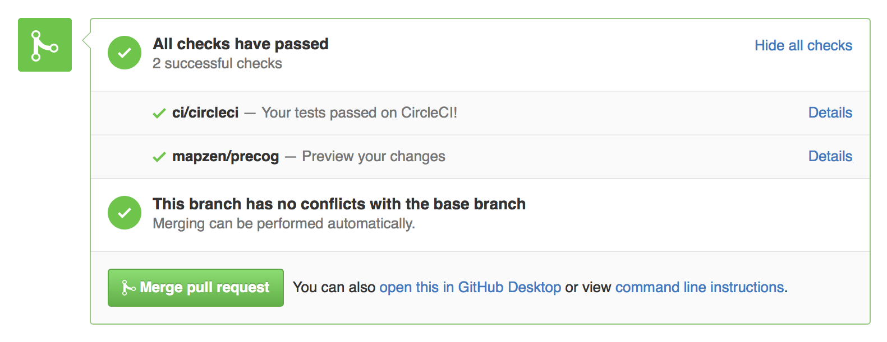

Precog
======

Previously [known as Git-Jekyll Preview](http://github.com/codeforamerica/git-jekyll-preview).

Preview your static websites built with CircleCI before making them live.
Use it to check your plain static or [Jekyll](http://jekyllrb.com/)-generated
websites before you make them live to [Github Pages](http://pages.github.com/)
or to your own server. Requires configured and working
[CircleCI artifacts](https://circleci.com/docs/build-artifacts).

Try it live at [precog.mapzen.com](http://precog.mapzen.com).

Basic Usage
-----------

1.  Add your repo to CircleCI using _Add Projects_ button at https://circleci.com/dashboard.
    
2.  Edit `circle.yml` to [generate build artifacts](https://circleci.com/docs/build-artifacts)
    and help Precog find them:
    
    *   Tell CircleCI where to find a directory of statically-built files.
        For example, Jekyll creates a `_site` folder by default:
    
            general:
              artifacts:
                - "_site"
    
        Precog will look only in the first named directory.
        Try to include an `index.html`.
    
    *   Alternatively, copy all statically-built files to `$CIRCLE_ARTIFACTS`
        directory after tests are complete:
    
            test:
              override:
                - make dist
                - cp -Lr dist $CIRCLE_ARTIFACTS/

To have Precog populate Github pull requests with direct links to previews,
see _Using Webhooks_ below.

Status, Contact
---------------

Precog is mostly a singleton-app, built only to be run at a single
location. For the time being, it's not intended for general redeployment but
improvements for [precog.mapzen.com](http://precog.mapzen.com)
are welcomed.

[Michal Migurski](https://github.com/migurski) is currently maintainer.

Install
-------

The application is a [Flask](http://flask.pocoo.org)-based Python server.
[OAuth](http://developer.github.com/v3/oauth/) is used for authentication;
put your client ID and secret in environment variables `GITHUB_CLIENT_ID`
and `GITHUB_CLIENT_SECRET`, and your CircleCI developer key in `CIRCLECI_TOKEN`.

To run for testing:

    python make-it-so.py

To run in production, with [Gunicorn](http://gunicorn.org):

    gunicorn make-it-so:app

Using Webhooks
--------------

Precog can accept push and pull requests from Github to generate direct links
to commit previews for you, and show them as a successful status check in
Github’s pull request interface:

This must be enabled separately for each repository, and requires a Github
personal access token to write results back to the Github Status API.

1. Generate a [personal access token](https://github.com/settings/tokens) and
   give it a descriptive name like “Precog Status Updates: {repo name}” so
   you can figure out what it is later. Give it `repo` scope access.
   
2. Make a random alphanumeric secret that will be shared between Precog
   and Github’s webhook setting, to ensure that only requests from the right
   repository will be acted on.
   
3. Add or update configuration settings in Precog’s environment variables,
   each called `WEBHOOK_CONFIG_{something}` and containing settings for each
   repository Precog should listen for:
   
        WEBHOOK_CONFIG_blog: mapzen/blog:xxy:xyx
        WEBHOOK_CONFIG_style: mapzen/styleguide:xyy:yxx
        WEBHOOK_CONFIG_yours: {your repo}:{secret}:{token}
   
   Currently, this must be done by talking to Mike.
   
4. Add a webhook to the Github repository, using the payload URL
   `https://precog.mapzen.com/hook`, the secret from earlier, and the
   `application/json` content type. Send just the Pull Request and Push events.
